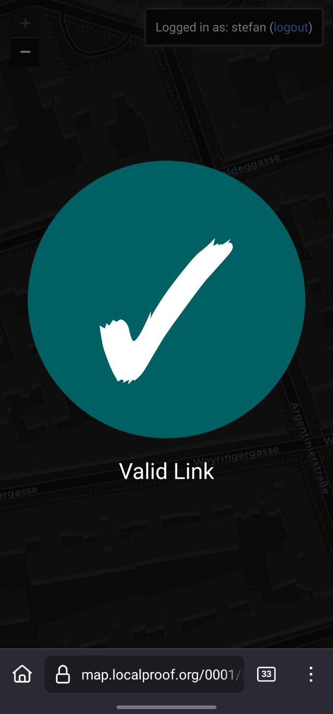

### The Hardware Setup

The first challenge was to ensure the device could keep accurate time without relying on an internet connection. I started with an ESP8266 microcontroller and its built-in Wi-Fi module, but I wanted the device to work completely offline. A friend lent me a GPS module, and I discovered that it could also receive accurate time data from GPS satellites.

The hardware setup:

- **ESP32 Microcontroller**: Upgrade from the ESP8266 because I needed more GPIO pins.
- **NEO-6M GPS Module**: To acquire location and time data.
- **DS3231 Real-Time Clock (RTC) Module**: To maintain accurate time.
- **Waveshare 1.54" Black/White E-Paper Display**: I chose a black-and-white display over a color one because the refresh rate is much faster (2 seconds vs. 8 seconds).
- **2N2222 NPN Bipolar Transistor**: To switch off the GPS module once it acquires the location and time.
- **Breadboard and Cables**: For prototyping.
- **5.1K Resistor**: For circuit stability.

---

### Operation breakdown

1. **Boot-Up**: On startup, the device begins acquiring a GPS signal to get the current time and location. This process usually takes up to 2 minutes.
2. **GPS Shutdown**: Once the GPS module has acquired GPS data, it’s turned off using the 2N2222 transistor.
3. **TOTP Generation**: The device waits until the next half-minute mark, then generates a TOTP number using a hard-coded key. 
4. **QR Code Creation**: A link is generated containing the device ID and the encrypted TOTP number. In the future, I want to add the location data as well (which also would have to be encoded).
5. **Display**: The QR code is displayed on the e-paper screen. To make it easier for users to verify the device, I added a small square in the center of the screen showing the first two and last two digits of the TOTP number.
6. **Deep Sleep**: After rendering the QR code, the device goes into deep sleep to save power (27 seconds).

I set up a Flask server to verify the QR codes. When a code is scanned, the server returns a JSON response confirming the validity.

At this stage, the device is fully functional. It can generate and display QR codes, and the Flask server can verify them.

---

### Next Steps

1. **Hardware Security Module (HSM)**: I’ve ordered an HSM module to handle TOTP creation and encryption, which will prevent device duplicates.
2. **Web Implementation**: More user-friendly web interface for device registration and verification.
4. **Battery Module**: Adding a battery will make the device portable.
5. **Map Integration**: A map to visualize registered devices and their locations.
6. **Casing Design**: Designing a 3D-printed casing

If you’re interested in following this project, feel free to reach out or leave a comment. I’ll be sharing updates of my progress!

[Project on GitHub](https://github.com/sweing/TOTP-QR-Gen?raw=true)

---